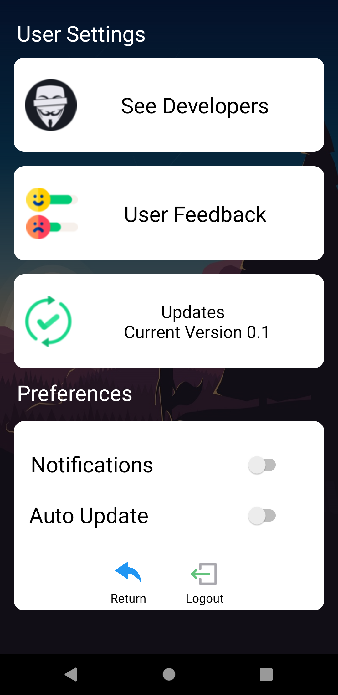

# DIU_Informatica

<h4> login with user accounts </h4>

	
	

<h4>after click in foods option </h4>

	
	

<h4>after click in bus option </h4>

	
	

<h4>after click in settings logo </h4>

	

<h4> login with emergency login option </h4>

	

